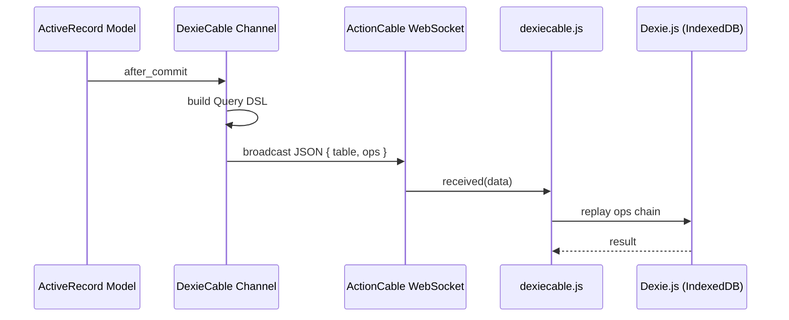

# DexieCable

> [!NOTE]
> DexieCable is NOT a local-first solution, because it lacks the capability to automatically sync updates back to the server (this might be added later). For now, think of it as a real-time local-cache solution. Also, check out this [blog post introducing DexieCable](https://dev.to/buhrmi/real-time-rails-without-turbo-modern-reactive-uis-with-inertia-and-dexiecable-4lge).

DexieCable augments ActionCable channels with a query DSL that mirrors the Dexie.js API, letting you push database mutations from the server to the client in real time. It also gives you a [`streams_to_dexie`](#streams_to_dexie--automatic-model-syncing) ActiveRecord macro for automatic change syncing.

You can run any Dexie table update directly inside a channel:

```ruby
class UserChannel < ApplicationCable::Channel
  include DexieCable

  def subscribed
    stream_for current_user
    recent_notifications = current_user.notifications.last(10)
    table("notifications").bulkAdd(recent_notifications)
  end
end
```

Or from inside a controller:

```ruby
class NotificationsController < ApplicationController
  def create
    notification = current_user.notifications.create!(notification_params)
    UserChannel[current_user].table("notifications").add(notification)
  end
end
```

An even more convenient way is to use the `streams_to_dexie` macro (more info [below](#streams_to_dexie--automatic-model-syncing))

```ruby
class Notification < ApplicationRecord
  streams_to_dexie via: UserChannel, to: :user
end
```

## Installation

### Ruby gem

Add to your `Gemfile`:

```ruby
gem "dexiecable"
```

Then `bundle install`. The Railtie automatically extends `ActiveRecord::Base` with `streams_to_dexie`.

### npm package

```bash
npm install dexiecable
# or
yarn add dexiecable
```

Pass your Dexie database as the first argument to `subscribe()`:

```js
import { subscribe } from "dexiecable";
import { db } from "./db";

subscribe(db, "UserChannel");
```

A consumer is lazily created on the first `subscribe()` call. If you need to access or set the consumer explicitly, use `getConsumer()` and `setConsumer()`:

```js
import { getConsumer, setConsumer, createConsumer } from "dexiecable";

// Get the consumer (creates one lazily if needed)
const consumer = getConsumer();

// Or set a custom one
setConsumer(createConsumer("wss://example.com/cable"));
```

## Usage

### `include DexieCable` in a channel

```ruby
class UserChannel < ApplicationCable::Channel
  include DexieCable

  def subscribed
    stream_for current_user
  end
end
```

This gives you:

| Method | Description |
|---|---|
| `self.[](to)` | Returns a `ScopedChannel` bound to a recipient. `UserChannel[current_user]` |
| `table(name)` | Starts a query chain. `table("messages")` |

### Chaining Dexie operations

Any Dexie.js write operation triggers an immediate broadcast:

```ruby
# Single insert
UserChannel[current_user].table("messages").add(id: 1, text: "hello")

# Bulk insert
UserChannel[current_user].table("messages").bulkAdd(messages)

# Update (using modify)
UserChannel[current_user]
  .table("messages")
  .where(:id).equals(msg.id)
  .modify(read: true)

# Update (using update)
UserChannel[current_user]
  .table("messages")
  .update(msg.id, text: "updated text")

# Delete
UserChannel[current_user]
  .table("messages")
  .where(:room_id).equals(room.id)
  .delete()
```

The full query chain is serialized as JSON and sent over ActionCable. The JS client replays every method call against the local Dexie database in order.

### `streams_to_dexie` — automatic model syncing

Add to any ActiveRecord model. Just provide the channel class and the broadcast target.

```ruby
class Message < ApplicationRecord
  # Calls send(:receiver), then broadcasts: UserChannel.broadcast_to(receiver, ...)
  streams_to_dexie via: UserChannel, to: :receiver

  # String used directly: UserChannel.broadcast_to("global_feed", ...)
  streams_to_dexie via: UserChannel, to: "global_feed"

  # Procs are also supported. If an array is returned, multiple broadcasts are made
  # conversation.users.each { |u| UserChannel.broadcast_to(u, ...) }
  streams_to_dexie via: UserChannel, to: -> { conversation.users }
end
```

Internally, `streams_to_dexie` sets up the following ActiveRecord callbacks:

| Event | Action |
|---|---|
| `after_commit on: :create` | `channel.table(table).add(as_json_for_dexie)` |
| `after_commit on: :update` | `channel.table(table).update(id, as_json_for_dexie.slice(*saved_changes.keys))` |
| `after_commit on: :destroy` | `channel.table(table).delete(id)` |

#### Options

| Option | Default | Description |
|---|---|---|
| `via:` | *(required)* | A DexieCable channel class |
| `to:` | *(none)* | The stream target passed to `broadcast_to`. Symbol → calls `send`. String → used as-is. Proc → evaluated in record context. Returns a single recipient or collection. |
| `table:` | model's `table_name` | Override the Dexie table name. A Proc is evaluated in the record's context. |
| `only:` | `[:create, :update, :destroy]` | Limit which events trigger a sync |
| `with:` | `:as_json_for_dexie` | Method name (Symbol) or Proc for serializing records |
| `if:` | *(none)* | Symbol (method name) or Proc — only sync when it returns truthy |
| `unless:` | *(none)* | Symbol (method name) or Proc — skip sync when it returns truthy |

You can combine multiple `streams_to_dexie` declarations, each with different conditions:

```ruby
class Message < ApplicationRecord
  streams_to_dexie via: UserChannel, to: -> { sender },
                 if: :published?

  streams_to_dexie via: AdminChannel,
                 unless: -> { draft? }
end
```

#### Customizing the synced payload

Override `as_json_for_dexie` in your model, or use the `with` option to specify a different method or Proc:

```ruby
class Message < ApplicationRecord
  # Using the default as_json_for_dexie override:
  streams_to_dexie via: UserChannel, to: :sender

  def as_json_for_dexie
    super.merge(room_name: room.name)
  end

  # Or use a custom serializer method:
  streams_to_dexie via: AdminChannel, to: :admin,
                 with: :admin_payload

  def admin_payload
    attributes.slice("id", "body", "flagged")
  end

  # Or a Proc:
  streams_to_dexie via: PublicChannel,
                 with: -> { { id: id, summary: body.truncate(100) } }
end
```

## How it works



The Ruby side builds a JSON payload like:

```json
{
  "table": "messages",
  "ops": [
    { "method": "where", "params": ["room_id"] },
    { "method": "equals", "params": [5] },
    { "method": "add", "params": [{ "id": 1, "text": "hello" }] }
  ]
}
```

The JS side replays it as:

```js
dexie.messages.where("room_id").equals(5).add({ id: 1, text: "hello" })
```

## Recipies

### Use sequence IDs to avoid data loss

A common pattern to avoid data loss during transient disconnections is using sequence IDs to bridge the offline gap and detect gaps in transmitted records. When a connection drops, updates continue on the server. Sending the client’s latest known sequence ID upon reconnect allows the backend to query and stream only the records missed while offline.

To enable this, DexieCable ships its own version of the ActionCable client with one key
extension: **channel params can be functions**. When a param value is a
function, it is called and awaited at subscribe time — use this to submit the latest known sequence ID on connection:

```js
import { subscribe } from "dexiecable";
import { db, getLastSeqId } from './database';

const roomId = 123;

subscribe(db, {
  channel: "RoomChannel",
  room_id: roomId,
  seq_id: () => getLastSeqId(roomId) // evaluated fresh on each reconnect
});
```

Send missed messages on reconnection:

```ruby
class RoomChannel < ApplicationChannel:Base
  def subscribed
    stream_from "room:#{params[:room_id]}"
    missed_messages = room.messages.where("seq_id > ?", params[:seq_id])
    table("messages").bulkAdd(missed_messages)
  end
end
```

To add Sequence IDs, you might want to have look at the [Sequenced](https://github.com/derrickreimer/sequenced). Another option is to use [AnyCable](https://docs.anycable.io/rails/getting_started) since it guarantees deliveries of ActionCable messages.

### Multi-user environments

In multi-user or multi-tenant applications, you can isolate records by binding different subscription channels to separate Dexie database instances. This prevents local data leaks between user accounts and keeps private user data separate from public or shared feeds.

```js

import Dexie from 'dexie'
import { subscribe } from 'dexiecable'

const userDB = new Dexie("user_"+userId)
const sharedDB = new Dexie("shared")

subscribe(userDB, 'UserChannel')
subscribe(sharedDB, 'PublicChannel')

```

## License

MIT
