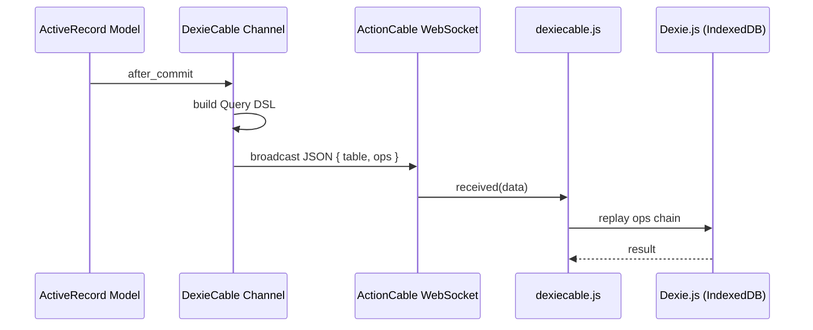

# DexieCable

> [!NOTE]
> By itself, DexieCable is NOT a local-first solution. It has no automatic capability to push client-side changes back to the server.
>
> An addon providing full synchronization based on event streams is currently in development. But for now, if you need full synchronization, you'll have to roll your own.

## Who's this for?

DexieCable is made for Ruby on Rails apps that manage their client-side state in Dexie and use Dexie live queries fir reactive UI updates. It provides an alternative to Turbo Streams for people who prefer component frameworks (React, Vue, Svelte, etc.) over of Turbo. 

## How does it work?

DexieCable gives your ActionCable channel a query DSL that mirrors the [Dexie.js API](https://dexie.org/docs), letting you push database mutations from the server to the client in real time. It also gives you a [`syncs_to_dexie`](#syncs_to_dexie-automatic-model-streaming) ActiveRecord macro for automatic change syncing.

Push Dexie table updates to a client from anywhere on the server:

```ruby
class NotificationsController < ApplicationController
  def create
    notification = current_user.notifications.create!(notification_params)
    DexieChannel[current_user].table("notifications").add(notification)
  end
end
```

Or sync model changes automatically with the `syncs_to_dexie` macro (more info [below](#syncs_to_dexie-automatic-model-streaming))

```ruby
class Notification < ApplicationRecord
  syncs_to_dexie via: :user
end
```

## What's new in 2.0

### Custom Channels

DexieCable 2.0 is a mixin. Create your own `DexieChannel` and `include DexieCable`:

```ruby
class DexieChannel < ApplicationCable::Channel
  include DexieCable
end
```

### Reuse the same subscription for multiple streams

On the client, subscribe to that channel and add streams as needed. `addStream` accepts a signed token or a plain string, and returns a function that removes the stream:

```js
const subscription = subscribe(db);
const unsubscribe = subscription.addStream(userStreamToken);
```

### Subscription hook

A new `subscribed_to` hook to push initial data before any live mutation arrives. The first argument is the record the token was issued for, or the plain stream name for a public stream:

```ruby
class DexieChannel < ApplicationCable::Channel
  include DexieCable

  def subscribed_to(record, params)
    case record
    when "feed"
      table(record).bulkAdd(Announcement.for_stream(record).map(&:as_json_for_dexie))
    when User
      table("notifications").bulkAdd(record.notifications.map(&:as_json_for_dexie))
    end
  end
end
```

## Installation

### Ruby gem

Add to your `Gemfile`:

```ruby
gem "dexiecable"
```

Then `bundle install`. The Railtie automatically extends `ActiveRecord::Base` with `syncs_to_dexie`.

### npm package

```bash
npm install dexiecable
# or
yarn add dexiecable
```

Pass your Dexie database as the first argument to `subscribe()`:

```js
import { subscribe } from "dexiecable";
import { db } from "./db";

const subscription = subscribe(db);
// Stream tokens come from the server: DexieChannel.stream_token_for(target)
subscription.addStream(streamToken);
```

A consumer is lazily created on the first `subscribe()` call. If you need to access or set the consumer explicitly, use `getConsumer()` and `setConsumer()`:

```js
import { getConsumer, setConsumer, createConsumer } from "dexiecable";

// Get the consumer (creates one lazily if needed)
const consumer = getConsumer();

// Or set a custom one
setConsumer(createConsumer("wss://example.com/cable"));
```

## Usage

### DexieChannel

Create a `DexieChannel` in your app and `include DexieCable` in it. Every Dexie broadcast goes through this channel:

```ruby
# app/channels/dexie_channel.rb
class DexieChannel < ApplicationCable::Channel
  include DexieCable
end
```

Stream tokens are signed with the application secret, so a client can only subscribe to streams the server has issued for it:

```ruby
DexieChannel.stream_token_for(target)
```

For an ActiveRecord model it returns a signed GlobalID (Rails' `signed_id`):

```ruby
DexieChannel.stream_token_for(current_user)
# => "signed global id"
```

Tokens never expire by default. Pass `expires_in:` or `expires_at:` to limit a token's lifetime:

```ruby
DexieChannel.stream_token_for(current_user, expires_in: 1.day)
```

Send that token to the client (render it in a view, return it from an endpoint, etc.) and add it to the subscription:

```js
const subscription = subscribe(db);
const stopStreaming = subscription.addStream(userStream);
```

`addStream` returns a function that removes the stream, so you can clean up later:

```js
stopStreaming(); // equivalent to subscription.removeStream(userStream)
```

`addStream`/`removeStream` perform `add_stream`/`remove_stream` on `DexieChannel`, which verifies the token and then `stream_from`/`stop_stream_from` the decoded identifier. `removeAllStreams()` performs `remove_all_streams`, stopping every current stream. Handy on logout:

```js
subscription.removeAllStreams();
```

#### Customizing DexieChannel

Add custom actions or push initial data directly on your channel:

```ruby
# app/channels/dexie_channel.rb
class DexieChannel < ApplicationCable::Channel
  include DexieCable

  # Push a snapshot when a stream is added. `record` is a record for private
  # streams, or the stream name (String) for public streams.
  def subscribed_to(record, params)
    case record
    when User
      table("notifications").bulkAdd(record.notifications.map(&:as_json_for_dexie))
    when Conversation
      table("messages").bulkAdd(record.messages.where("seq_id > ?", params[:last_seq_id]).map(&:as_json_for_dexie))
    when String
      table(record).bulkAdd(Announcement.for_stream(record).map(&:as_json_for_dexie))
    end
  end

  # Any public method is a custom action the client can perform.
  def mark_as_read(data)
    Message.find(data["id"]).update!(read: true)
  end
end
```

The client subscribes to `DexieChannel` by default:

```js
const subscription = subscribe(db);
```

Pass params from the client when adding a stream:

```js
subscription.addStream(userStream, { last_seq_id: 100 });
```

`subscribed_to` runs after the stream is opened, and `table(...)` transmits to just this subscriber, so the snapshot arrives before any live mutation. Custom actions are triggered like any ActionCable action: `subscription.perform("mark_as_read", { id: 42 })`.

#### Public streams

For data that's public (a global feed, announcements, etc.), skip the signature. Use a string target. It's namespaced under `public:` automatically:

```ruby
DexieChannel["feed"].table("announcements").add(announcement)

# or, on a model:
class Announcement < ApplicationRecord
  syncs_to_dexie via: "feed"
end
```

Then subscribe by name. No token required:

```js
const stopPublicStream = subscription.addStream("feed");
stopPublicStream(); // equivalent to subscription.removeStream("feed")
```

Public streams are namespaced under `public:`, so this path can never reach a signed (private) stream.

`DexieChannel[target]` returns a scoped channel for broadcasting to one recipient:

```ruby
DexieChannel[current_user].table("notifications").add(notification)
```

### Chaining Dexie operations

Any Dexie.js write operation triggers an immediate broadcast:

```ruby
# Single insert
DexieChannel[current_user].table("messages").add(id: 1, text: "hello")

# Bulk insert
DexieChannel[current_user].table("messages").bulkAdd(messages)

# Update (using modify)
DexieChannel[current_user]
  .table("messages")
  .where(:id).equals(msg.id)
  .modify(read: true)

# Update (using update)
DexieChannel[current_user]
  .table("messages")
  .update(msg.id, text: "updated text")

# Delete
DexieChannel[current_user]
  .table("messages")
  .where(:room_id).equals(room.id)
  .delete()
```

The full query chain is serialized as JSON and sent over ActionCable. The JS client replays every method call against the local Dexie database in order.

### `syncs_to_dexie`: automatic model streaming

Add to any ActiveRecord model. Optionally provide the broadcast target.

```ruby
class Message < ApplicationRecord
  # Calls send(:receiver), then broadcasts: DexieChannel.broadcast_to(receiver, ...)
  syncs_to_dexie via: :receiver

  # String = public stream (subscribe via addStream("public"))
  syncs_to_dexie via: "public"

  # Procs are also supported. If an array is returned, multiple broadcasts are made
  # conversation.users.each { |u| DexieChannel.broadcast_to(u, ...) }
  syncs_to_dexie via: -> { conversation.users }
end
```

Broadcasts go out over `DexieChannel`, the channel DexieCable provides. On the client, subscribe to it and add the stream token returned by `DexieChannel.stream_token_for(target)`:

```js
const subscription = subscribe(db);
subscription.addStream(streamIdentifier);
```

Internally, `syncs_to_dexie` sets up the following ActiveRecord callbacks:

| Event | Action |
|---|---|
| `after_commit on: :create` | `channel.table(table).add(as_json_for_dexie)` |
| `after_commit on: :update` | `channel.table(table).update(id, as_json_for_dexie.slice(*saved_changes.keys))` |
| `after_commit on: :destroy` | `channel.table(table).delete(id)` |

#### Options

| Option | Default | Description |
|---|---|---|
| `via:` | the record itself | The stream target. Symbol → calls `send` (a record, signed). String → public stream name. Proc → evaluated in record context. Returns a single recipient or collection. |
| `table:` | model's `table_name` | Override the Dexie table name. A Proc is evaluated in the record's context. |
| `only:` | `[:create, :update, :destroy]` | Limit which events trigger a sync |
| `with:` | `:as_json_for_dexie` | Method name (Symbol) or Proc for serializing records |
| `if:` | *(none)* | Symbol (method name) or Proc. Only sync when it returns truthy |
| `unless:` | *(none)* | Symbol (method name) or Proc. Skip sync when it returns truthy |

You can combine multiple `syncs_to_dexie` declarations, each with different conditions:

```ruby
class Message < ApplicationRecord
  syncs_to_dexie via: -> { sender },
                 if: :published?

  syncs_to_dexie unless: -> { draft? }
end
```

#### Customizing the synced payload

Override `as_json_for_dexie` in your model, or use the `with` option to specify a different method or Proc:

```ruby
class Message < ApplicationRecord
  # Using the default as_json_for_dexie override:
  syncs_to_dexie via: :sender

  def as_json_for_dexie
    super.merge(room_name: room.name)
  end

  # Or use a custom serializer method:
  syncs_to_dexie via: :admin,
                 with: :admin_payload

  def admin_payload
    attributes.slice("id", "body", "flagged")
  end

  # Or a Proc:
  syncs_to_dexie with: -> { { id: id, summary: body.truncate(100) } }
end
```

## How it works



The Ruby side builds a JSON payload like:

```json
{
  "table": "messages",
  "ops": [
    { "method": "where", "params": ["room_id"] },
    { "method": "equals", "params": [5] },
    { "method": "add", "params": [{ "id": 1, "text": "hello" }] }
  ]
}
```

The JS side replays it as:

```js
dexie.messages.where("room_id").equals(5).add({ id: 1, text: "hello" })
```

## License

MIT
