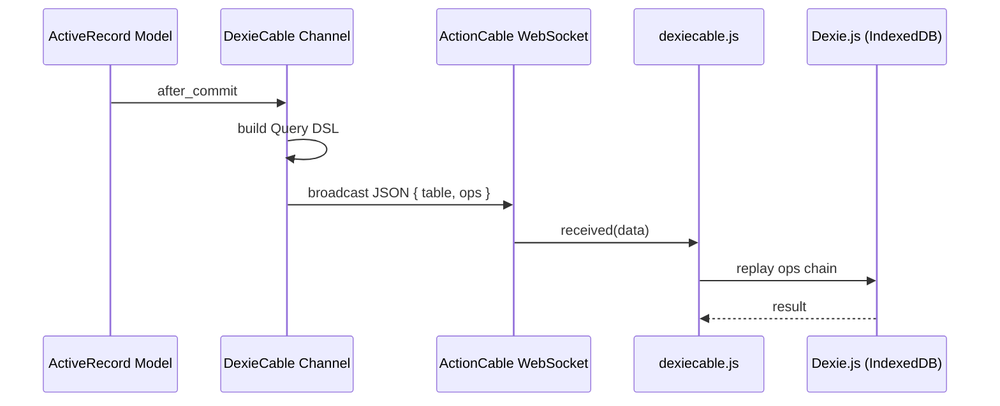

# DexieCable

Run [Dexie.js](https://dexie.org) IndexedDB operations from your Rails ActionCable channels.

DexieCable augments ActionCable channels with a query DSL that mirrors the Dexie.js API, letting you push database mutations from the server to the client in real time. It also gives you a `syncs_to_dexie` ActiveRecord macro for automatic change syncing.

You can run any Dexie table update directly inside a channel:

```ruby
class UserChannel < ApplicationCable::Channel
  include DexieCable

  def subscribed
    stream_for current_user
    recent_notifications = current_user.notifications.last(10)
    table("notifications").bulkAdd(recent_notifications)
  end
end
```

Or from inside a controller:

```ruby
class NotificationsController < ApplicationController
  def create
    notification = current_user.notifications.create!(notification_params)
    UserChannel[current_user].table("notifications").add(notification)
  end
end
```

An even more convenient way is to use the `syncs_to_dexie` macro:

```ruby
class Notification < ApplicationRecord
  syncs_to_dexie via: UserChannel, subject: :user
end
```

## Installation

### Ruby gem

Add to your `Gemfile`:

```ruby
gem "dexiecable"
```

Then `bundle install`. The Railtie automatically extends `ActiveRecord::Base` with `syncs_to_dexie`.

### npm package

```bash
npm install dexiecable
# or
yarn add dexiecable
```

Configure it with your Dexie database and ActionCable consumer before subscribing:

```js
import { configure, subscribe } from "dexiecable";
import { db } from "./db";
import { createConsumer } from "@rails/actioncable";

configure({ db, consumer: createConsumer() });

const sub = subscribe("UserChannel", { last_update: Date.now() });
```

If you omit `consumer`, one is created for you automatically.

## Usage

### `include DexieCable` in a channel

```ruby
class UserChannel < ApplicationCable::Channel
  include DexieCable

  def subscribed
    stream_for current_user
  end
end
```

This gives you:

| Method | Description |
|---|---|
| `self.[](subject)` | Returns a `ScopedChannel` bound to a subject. `UserChannel[current_user]` |
| `table(name)` | Starts a query chain. `table("messages")` |

### Chaining Dexie operations

Any Dexie.js write operation triggers an immediate broadcast:

```ruby
# Single insert
UserChannel[current_user].table("messages").add(id: 1, text: "hello")

# Bulk insert
UserChannel[current_user].table("messages").bulkAdd(messages)

# Update (using modify)
UserChannel[current_user]
  .table("messages")
  .where(:id).equals(msg.id)
  .modify(read: true)

# Update (using update)
UserChannel[current_user]
  .table("messages")
  .update(msg.id, text: "updated text")

# Delete
UserChannel[current_user]
  .table("messages")
  .where(:room_id).equals(room.id)
  .delete()
```

The full query chain is serialized as JSON and sent over ActionCable. The JS client replays every method call against the local Dexie database in order.

### `syncs_to_dexie` — automatic model syncing

Add to any ActiveRecord model. `subject` is what gets passed to `broadcast_to` as the stream target:

```ruby
class Message < ApplicationRecord
  # Calls send(:receiver), then broadcasts: broadcast_to(receiver, ...)
  syncs_to_dexie via: UserChannel, subject: :receiver

  # String used directly: broadcast_to("global_feed", ...)
  syncs_to_dexie via: UserChannel, subject: "global_feed"

  # Procs are also supported. If an array is returned, multiple broadcasts are made
  # conversation.users.each { |u| broadcast_to(u, ...) }
  syncs_to_dexie via: UserChannel, subject: -> { conversation.users }
end
```

| Event | Action |
|---|---|
| `after_commit on: :create` | `channel.table("messages").add(record.as_json_for_dexie)` |
| `after_commit on: :update` | `channel.table("messages").put(record.as_json_for_dexie)` |
| `after_commit on: :destroy` | `channel.table("messages").delete(record.id)` |

#### Options

| Option | Default | Description |
|---|---|---|
| `via:` | *(required)* | A DexieCable channel class |
| `subject:` | *(none)* | The stream target passed to `broadcast_to`. Symbol → calls `send`. String → used as-is. Proc → evaluated in record context. Returns a single subject or collection. |
| `table:` | model's `table_name` | Override the Dexie table name. A Proc is evaluated in the record's context. |
| `only:` | `[:create, :update, :destroy]` | Limit which events trigger a sync |
| `if:` | *(none)* | Symbol (method name) or Proc — only sync when it returns truthy |
| `unless:` | *(none)* | Symbol (method name) or Proc — skip sync when it returns truthy |

You can combine multiple `syncs_to_dexie` declarations, each with different conditions:

```ruby
class Message < ApplicationRecord
  syncs_to_dexie via: UserChannel, subject: -> { sender },
                 if: :published?

  syncs_to_dexie via: AdminChannel,
                 unless: -> { draft? }
end
```

#### Customizing the synced payload

Override `as_json_for_dexie` in your model:

```ruby
class Message < ApplicationRecord
  syncs_to_dexie via: UserChannel, subject: :sender

  def as_json_for_dexie
    super.merge(room_name: room.name)
  end
end
```

## How it works



The Ruby side builds a JSON payload like:

```json
{
  "table": "messages",
  "ops": [
    { "method": "where", "params": ["room_id"] },
    { "method": "equals", "params": [5] },
    { "method": "add", "params": [{ "id": 1, "text": "hello" }] }
  ]
}
```

The JS side replays it as:

```js
dexie.messages.where("room_id").equals(5).add({ id: 1, text: "hello" })
```

## License

MIT
